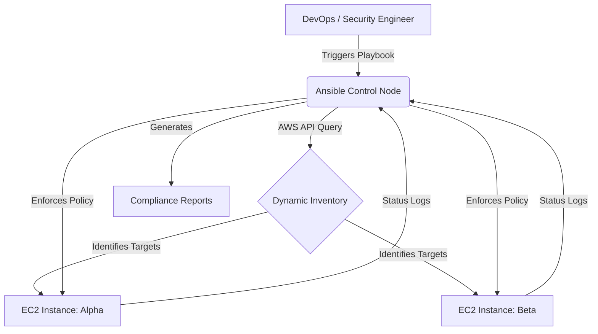

# 🛡️ Ansible Compliance Automation — AlphaSecure Systems

[](https://www.ansible.com/)
[](https://aws.amazon.com/)
[](https://opensource.org/licenses/MIT)
[](https://github.com/topics/compliance-as-code)

**Ansible Compliance Automation** is an enterprise-grade framework designed by **AlphaSecure Systems** to enforce security baselines and compliance policies across AWS Ubuntu infrastructure. By leveraging **Compliance-as-Code**, it eliminates manual overhead and ensures consistent, auditor-ready security postures.

---

## 🌟 Overview

Modern cloud environments suffer from configuration drift and delayed patching. This project provides a robust, idempotent workflow to:

*   **🔍 Auto-Discovery**: Real-time fleet detection using AWS Dynamic Inventory.
*   **📋 Baseline Auditing**: Comprehensive state capture of packages, users, and ports.
*   **�️ Hardening**: Automated remediation of security vulnerabilities.
*   **🔄 Self-Healing**: Continuous drift detection and correction.
*   **📊 Enterprise Reporting**: Generation of professional Markdown and HTML compliance reports.

---

## 🏗️ System Architecture

The workflow utilizes an Ansible Control Node to orchestrate tasks across dynamically discovered EC2 instances.



---

## 📂 Repository Structure

```text
ansible-compliance-automation/
├── ansible.cfg             # Core Ansible configuration
├── inventory/
│   └── aws_ec2.yml         # AWS Dynamic Inventory plugin config
├── playbooks/
│   ├── discovery.yml       # Server discovery & status checks
│   ├── remediation.yml     # Security hardening & patching
│   └── verification.yml    # Final audit & report generation
├── roles/
│   ├── baseline_audit/     # Records initial system state
│   ├── patch_management/   # Handles OS security updates
│   ├── security_hardening/ # Hardens SSH, Firewall, and Users
│   └── compliance_report/  # Compiles data into MD/HTML
├── group_vars/
│   └── all.yml             # Global policy variables
└── reports/                # Output directory for generated artifacts
```

---

## 🚀 Key Features

| Feature | Description |
| :--- | :--- |
| **Dynamic Scaling** | Automatically interacts with instances tagged `Project: Compliance-Alpha`. |
| **State Snapshots** | Records kernel version, ports, and users before any changes occur. |
| **Security Hardening** | Disables root login, enforces password complexity, and configures UFW. |
| **Idempotency** | Guaranteed safe execution; only modifies what is strictly necessary. |
| **Auditor-Friendly** | High-quality HTML reports with color-coded status indicators. |

---

## 🛠️ Technologies Used

*   **Ansible**: Core automation engine and orchestration.
*   **Ubuntu 20.04 LTS**: Standardized target operating system.
*   **AWS EC2 & Boto3**: Cloud infrastructure and Python SDK integration.
*   **Jinja2**: Dynamic report generation and configuration templating.

---

## 🚥 Getting Started

### Prerequisites

*   **Control Node**: Linux-based system (Ubuntu preferred).
*   **AWS Access**: IAM credentials with permissions to describe EC2 instances.
*   **SSH Access**: Private keys configured for target EC2 instances.

### 1. Installation

```bash
# Update system and install Ansible
sudo apt update && sudo apt install ansible python3-pip -y

# Install required AWS collections
ansible-galaxy collection install amazon.aws

# Install Python requirements
pip3 install boto3 botocore
```

### 2. Configuration

Set up your SSH key and ensure your AWS credentials are exported to your environment:
```bash
export AWS_ACCESS_KEY_ID='your_access_key'
export AWS_SECRET_ACCESS_KEY='your_secret_key'
export AWS_DEFAULT_REGION='your_region'
```

---

## 📖 Usage Guide

### Phase 1: Infrastructure Discovery
Verify which instances are currently detected by the dynamic inventory.
```bash
ansible-playbook -i inventory/aws_ec2.yml playbooks/discovery.yml \
  -u ubuntu --private-key ~/.ssh/compliance_key
```

### Phase 2: Policy Remediation
Execute security hardening and patch management roles.
```bash
ansible-playbook -i inventory/aws_ec2.yml playbooks/remediation.yml \
  -u ubuntu --private-key ~/.ssh/compliance_key
```

### Phase 3: Verification & Reporting
Perform the final audit and generate the compliance reports.
```bash
ansible-playbook -i inventory/aws_ec2.yml playbooks/verification.yml \
  -u ubuntu --private-key ~/.ssh/compliance_key
```

---

## 📝 Sample Compliance Report

The system generates a detailed summary for every managed host:

### Host: `server-alpha-01`
*   **Kernel**: `5.4.0-91-generic`
*   **Open Ports**: `22`, `443`
*   **Security Patches**: `Updated (12 packages)`
*   **Hardening Status**: ✅ **Compliant**
*   **Last Audit**: `2026-03-08 20:54 UTC`

---

## �️ Security Best Practices

*   **Principle of Least Privilege**: Ensure the Ansible IAM user has restricted permissions.
*   **Continuous Compliance**: Integrate this workflow with a CI/CD pipeline (e.g., Jenkins or GitLab CI) for scheduled audits.
*   **Secure Vaults**: Use `ansible-vault` to encrypt sensitive variables and SSH keys.

---
